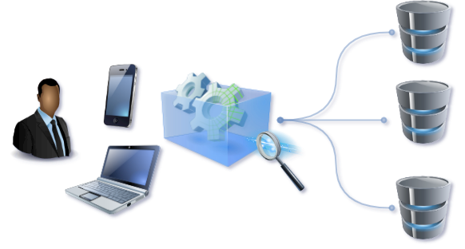

# Visulate for Oracle
Catalog and document your Oracle databases in a single location

## Features

### One tool
Single tool to catalog the company's Oracle databases. Search and browse the data dictionary in each database. 

### Web-based
No client code to download or host via Citrix. Create bookmarks and links to schemas and objects.

### Identify Dependencies
Query the database's dependency model to identify dependencies to and from the object (e.g a view "uses" the tables it is based on and is "used by" a procedure that selects from it).

### API Support
APIs are available for all application features.

### Advanced Search and Filter
Single query to find a objects by name in every schema and database. Filtered search to find objects in a database that match a wildcard pattern (e.g. E-Business Suite product prefix). Advanced search API to identify objects and their dependent objects (e.g. a find the schema definition for a stored procedure and every object it needs to install cleanly)

### DDL Download
Call dbms_metadata to get DDL for individual objects or groups of objects.

## Common use cases

### Oracle license management 
Catalog all of your company's Oracle database instances in preparation for a compliance audit. Identify Enterprise Edition feature and option usage. Find Enterprise Edition license instances that could be be downgraded to Standard Edition 2. Review the contents of old databases. What are they really running? Identify targets for consolidation or decommissioning. 

### Custom development
Document custom code in your COTS application database. Examine dependencies before a schema change. Download and diff the DDL for tables in your development and test environments.  

### On-Premises to Cloud migration
Document and analyze on-premises environments. Examine custom PL/SQL and other database related program logic (stored procedures, triggers, scripts, and so on) and re-write for the cloud.

Identify candidates for conversion to Postgres. Find dependencies and SQL statements in stored procedures. Download the DDL to refactor a single monolithic schema for use in microservices. 
